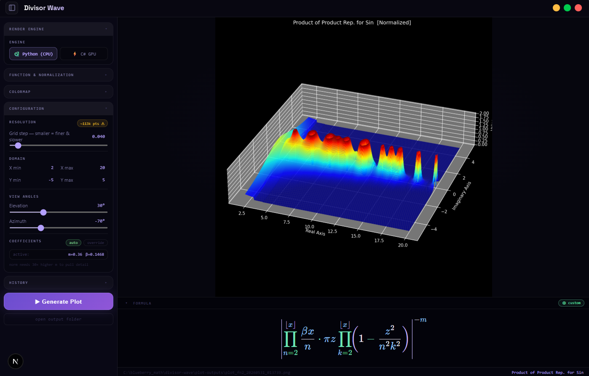

# Divisor Wave Plotter

An Electron + Next.js desktop app for generating 3D surface plots of infinite-product functions over the complex plane. The functions are motivated by a connection between divisor waves, prime number distribution, and the Riemann Hypothesis.



*Product of Product Representation for Sin — Normalized, Jet colormap, x∈[2,20], y∈[-5,5]*

---

## Mathematical Background

A **divisor wave** of order k is a real-variable function of the form:

$$a_k(x) = \left| \alpha \frac{x}{k} \sin\!\left(\frac{\pi x}{k}\right) \right|$$

where k is a positive integer greater than 1. Its zeros fall at every integer multiple of k, and its amplitude grows as α(x/k). Taking the infinite product over all k from 2 to x:

$$f(x) = \prod_{k=2}^{x} a_k(x)$$

produces a function that is zero at every composite integer and nonzero at every prime — effectively a continuous analogue of the Sieve of Eratosthenes. Extending this to the complex plane and composing with other infinite-product representations (Riesz, Viète, product rep. for sin) is the central object of study.

The functions are rendered as 3D surfaces over the complex plane: the real axis runs left-right, the imaginary axis runs front-back, and the z-axis shows the function's magnitude.

---

## Structure

```
python-divisor-wave/        # matplotlib 3D renderer and function library
  special_functions.py      # all 32 infinite-product functions
  plot_cli.py               # headless CLI, spawned by Electron
  divisor_wave_plotting.py  # original PyQt5 GUI (legacy)

electron-divisor-wave/      # Electron shell + Next.js UI
  pages/index.js            # full React UI
  electron/main.js          # IPC bridge to Python CLI
  electron/preload.js       # context-isolated API surface

c-sharp-plotting/           # C# alternative plotter
latex-divisor-wave-paper/   # LaTeX paper: "Divisor Wave Product Analysis of Prime and Composite Numbers"
plot-outputs/               # saved PNG renders (gitignored)
```

---

## Running

**Requirements:** Python 3, Node.js

```bash
# 1. Python dependencies (one-time)
python -m venv venv
venv\Scripts\activate        # Windows
# source venv/bin/activate   # macOS / Linux
pip install numpy matplotlib scipy mpmath

# 2. Node dependencies (one-time)
cd electron-divisor-wave
npm install

# 3. Launch
npm run dev
```

The Electron window opens automatically once Next.js is ready on `http://localhost:3000`. Plots are saved as PNGs to `plot-outputs/`.

### Headless CLI

The Python backend can also be used directly:

```bash
python python-divisor-wave/plot_cli.py \
  --function 2 --normalize Y --colormap 2 \
  --resolution 0.05 --xmin 2 --xmax 20 --ymin -5 --ymax 5 \
  --elev 30 --azim -45 --output ./plot-outputs
# prints: {"success": true, "path": "...", "name": "..."}

# Auto-fit coefficients without rendering:
python python-divisor-wave/plot_cli.py \
  --function 2 --normalize Y --auto-coeffs
# prints: {"success": true, "m": 0.36, "beta": 0.147, ...}
```

---

## Functions

32 functions in 7 groups, all evaluated pointwise over a meshgrid of complex numbers.

### Basic

| # | Name | Formula |
|---|------|---------|
| 1 | Product of Sin | $\prod_{n=2}^{x} \|\beta\tfrac{x}{n}\sin(\pi z/n)\|^{-m}$ |
| 2 | Product Rep. for Sin | $\prod_{n=2}^{x} \|\beta\tfrac{x}{n} \cdot \pi z \prod_{k=2}^{x}(1-z^2/n^2k^2)\|^{-m}$ |
| 4 | Complex Playground Demo | Riesz-cos variant, curated for visual interest |

### Riesz Products

$$\prod_{n=2}^{x} \left|1 + f(\pi z n)\right|^{-m} \quad f \in \{\cos, \sin, \tan\}$$

Functions 5, 6, 7.

### Viète Products

$$\prod_{n=2}^{x} \left|f\!\left(\frac{\pi z}{2^n}\right)\right|^{-m} \quad f \in \{\cos, \sin, \tan\}$$

Functions 8, 9, 10. These converge quickly — large `m` values are typically needed.

### Compositions

Outer trig applied to the product-of-sin or product-rep-for-sin:

- **11**: cos(Product of Sin)
- **12**: sin(Product of Sin)
- **13**: cos(Product Rep. for Sin)
- **14**: sin(Product Rep. for Sin)

### Prime Indicators

- **15 — Binary Prime Indicator H**: $H(z) = P_1(z)^{P_2(z)}$ — combines product-of-sin and product-rep-for-sin to produce peaks at primes.
- **16 — Prime Output Indicator J**: $J(z) = P_1^{P_1^{P_2}}$ — iterated tower form.
- **17 — BOPIF Q Alternation Series**: Alternating product $(-1)^{H(z)}$ composed with H and J.
- **18 — Dirichlet Eta from BOPIF**: $\prod(1 + Q \cdot J)^{-c}$ — motivated by the Dirichlet eta function.

### Analytic Baselines

Standard complex analysis references for comparison:

- **19**: $|\log\Gamma(z)|$
- **20**: $1/(1+z^2)$
- **21**: $|z^z|$
- **22**: $\Gamma(z)$

### Transforms / Custom / Experimental

- **23–25**: Log, Gamma, and Gamma-form transforms of the product rep.
- **26–27**: Custom Riesz–Tan and Viète–Cos with gamma normalization.
- **28**: Half-Base Viète–Sin (denominator $2^{-n}$ instead of $2^n$).
- **29**: Log-Power-Base Viète–Sin (denominator $2^{\frac{\log z}{n}}$).
- **30**: Riesz–Tan combined with the prime indicator.
- **31**: Nested roots / paradox product for 2.

---

## Coefficients

Each function is scaled by two parameters:

| Param | Role |
|-------|------|
| **m** | Exponent applied to the whole product — controls vertical stretch. Smaller = flatter surface; larger = taller peaks. |
| **β** | Lead amplitude coefficient inside each product term. |

Each function ships with hand-tuned defaults. The **auto** button samples the function on a coarse grid, computes log-mean and log-variance, and fits `m` and `β` using a Lyapunov-derived heuristic:

```
m_opt   = 1 / std(log|output|)
beta_opt = exp(mean(log|output|) / N_avg)
```

The **override** button lets you dial them in manually with sliders.

**Normalization** divides the product by $\Gamma(\text{result})$ before rendering, compressing large spikes and revealing finer structure.

---

## Controls

| Control | Description |
|---------|-------------|
| Function | Select from 32 functions grouped by type |
| Normalization | Raw or Normalized (÷Γ) |
| Colormap | Prism · Jet · Plasma · Viridis · Magma |
| Resolution | Grid step — smaller = finer & slower. ~80k points triggers a warning. |
| Domain | X min/max (real axis), Y min/max (imaginary axis) |
| View Angles | Elevation and azimuth for the 3D camera |
| Coefficients | Per-function m and β, with auto-fit and manual override |
| History | Last 20 renders shown as a strip at the bottom; click to reload |

---

## Paper

The accompanying LaTeX paper — *"Divisor Wave Product Analysis of Prime and Composite Numbers"* by Leo J. Borcherding — develops the theory behind these functions and their relationship to the distribution of primes. See [`latex-divisor-wave-paper/`](latex-divisor-wave-paper/).
